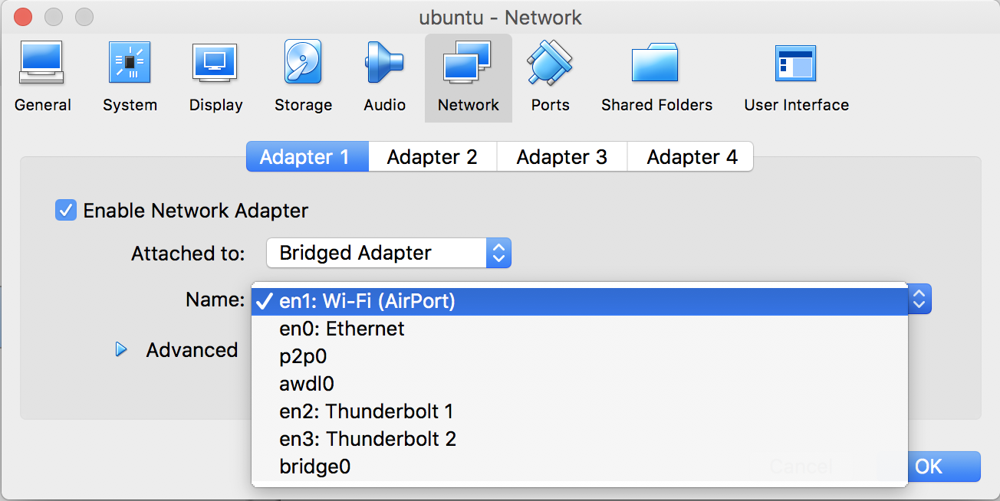

# Pre-requisite:
## Download ubuntu-16.04 server version at following official website
```
http://releases.ubuntu.com/16.04.5/
ubuntu-16.04.5-server-amd64.iso
```
## Setup VM for ubuntu 16.04 with 1G RAM and 1 core CPU is enough, Interface need to be bridge instead of NAT.

## Get IP address of Ubuntu, and access it as webserver IP address in home subnet
```
smart@ubuntu:~$ ifconfig
enp0s3    Link encap:Ethernet  HWaddr 08:00:27:ff:7f:42  
          inet addr:10.0.1.16  Bcast:10.0.1.255  Mask:255.255.255.0
          inet6 addr: fe80::a00:27ff:feff:7f42/64 Scope:Link
          UP BROADCAST RUNNING MULTICAST  MTU:1500  Metric:1
          RX packets:115442 errors:0 dropped:0 overruns:0 frame:0
          TX packets:18641 errors:0 dropped:0 overruns:0 carrier:0
          collisions:0 txqueuelen:1000 
          RX bytes:169992842 (169.9 MB)  TX bytes:1334661 (1.3 MB)
```
## Installation for python 2.7 in Ubuntu 16.04 or MacOS (If using vbox only need 1G RAM and 1 core CPU)
```
sudo apt-get install -y git
```
## Auto start recommendation engine
```
sudo sh env-installation.sh
```
## Manually Start recommendation engine
```
cd chooosie-deals-intelligent-system
source lambda_prototype/bin/activate
python ms-mlengine-local.py
```
## Use WEB browser access port 9080
```
localhost:9080
127.0.0.1:9080
(in the demo case) 10.0.1.16:9080
```
